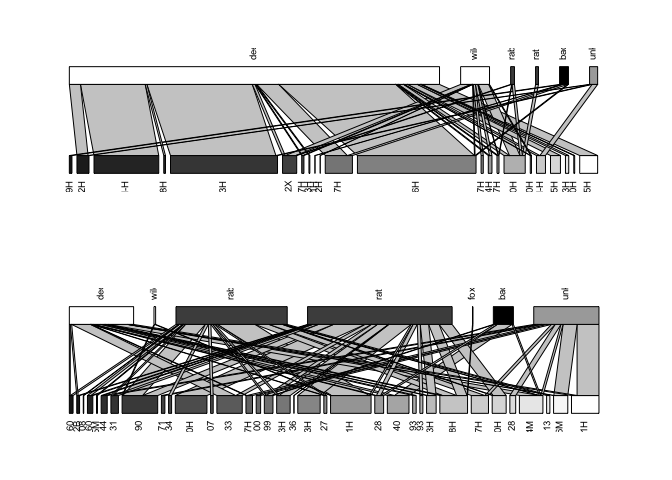

Frugivore efficiency network analysis
================

#### **Step 1. **Open Martinazo and Matasgordas efficiency matrix

Opening a matrix file with weighted links with frugivores fruit remotion efficiency in individual plants. The data set to construct this matrix was the resul of dividing *fruits/day and visits/day= fruits/visit*

``` r
#Martinazo
mart_e<-read.csv("~/Desktop/Palmito/Postdoc-Interaction Networks/Dispersal-Networks/Efficiency/mart_eff.csv",header=TRUE,check.names=FALSE,row.names=1)

#Matasgordas
matas_e<-read.csv("~/Desktop/Palmito/Postdoc-Interaction Networks/Dispersal-Networks/Efficiency/matas_eff.csv",header=TRUE,check.names=FALSE,row.names=1)
```

 

#### **Step 2.** Using "bipartite" package

 

    library(bipartite)

 

   

##### *Step 2.1.* Ploting the web.

Creates a bipartite network were the high level will be represented by the frugivores and low level to each individual plant. *Links are weigthed with the frugivory efficiency fruit animal/individual plant/visits per day*.[1]



   

#### **Step 3.** Calculate indices describing network topography.

##### **Step 4.1.** Network measures

 

-   **Network level** Analysis of bipartite webs at the level of the entire network

-   *Connectance:* Degree of specialization of the netwwork, meaure the proportion of possible links. C = L/(IJ). This is the standardized number of species combinations often used in co-occurrence analyses (Gotelli and Graves 1996); also identical to 2-species motifs sensu Milo et al. (2002).

-   *Cluster coefficient:* Mean, across all species, of the number of realized links divided by the number of possible links for each species (i.e. average per-species connectance).

-   *Web Assymethry:* Balance between numbers in the two levels W = (I– J)/(I+J). Positive numbers indicate more lower-trophic level species, negative more higher-trophic level species; rescaled to \[–1, 1\] (see Blüthgen et al. 2007).

-   *Nestednes and Wegihted Nestedness:* Interaction degree between specialists and the subset of species to which the generalists interact

 

``` r
#Martinazo
networklevel(mart_e, index = c("connectance","web asymmetry","cluster coefficient","nestedness","weighted nestedness"))
```

    ##            connectance          web asymmetry    cluster coefficient 
    ##              0.2878788             -0.5714286              0.1590909 
    ##             nestedness    weighted nestedness cluster.coefficient.HL 
    ##             19.0742453              0.6403868              0.7525009 
    ## cluster.coefficient.LL 
    ##              0.3620076

``` r
#Matasgordas
networklevel(matas_e,index = c("connectance","web asymmetry","cluster coefficient","nestedness","weighted nestedness"))
```

    ##            connectance          web asymmetry    cluster coefficient 
    ##              0.2647059             -0.6585366              0.2647059 
    ##             nestedness    weighted nestedness cluster.coefficient.HL 
    ##             26.3088963              0.4748063              0.4226532 
    ## cluster.coefficient.LL 
    ##              0.3247715

 

-   *Modularity:* Identify modules of closely interecting frugivores. Also test to what extent these modules have a spatial component. High modularity values means that the network is more stable.

Martinazo

    ## [1] 0.1928246

Matasgordas

    ## [1] 0.5641114

Modularity in Matasgordas (0.569946) than Martinazo (0.500577)

   

##### Ploting modules in the networks

          

Figure 3.

 

&nbsp \* **Link level.** Interaction variance between nodes. The outcome is a matrix with dependence values. Computes the contribution of each species to the overall nestedness.

``` r
link_lev_mart<-linklevel(mart_e)
link_lev_matas<-linklevel(matas_e)
```

   

 

##### **Step 5.**Calculate the topography of the nodes and their relative importance to the network. Information that we can relate to the aggregation level of this plants through GLM or GAM.

There are three different levels this can be achieved at: the entire web (using function networklevel), at the level of each group (also using function networklevel) or the individual species (using function specieslevel).

-   **Relative degree.** It is a centrality measure. Proportion of interactions in relation to the potential partners in the network. Importance with the number of plants or animals with which they interact. High values in individual plants in our system is related to "more attractiveness". (qualitative characteristic of the node) interact or not

-   **Species strength.** (Dorman, 2011). Describe how much the plants depends on the visits by a particular animal. Importance of the **plant** given by the porportion of visits of each animal. Instead, the values for **animals** tell us the importance of each animal given the proportion of visits that they made.

-   **Species Specificity.** Coefficient of variation of interactions, normalised to values between 0 and 1. Values of 0 indicate low, those of 1 a high variability (and hence suggesting low and high specificity). We can determine if certain **plants** have high visitation and fruit removal by animals or low. Instead, for **animals** we can determine if they have a high efficiency or low. (quantitative index). The difference in this index is that uses the "visitation values "efficiency" of each interaction.

-   **Node specialisation index.** Another measure of specialisation, based on the path length between any two higher-trophic level species. For instance, species sharing hosts/prey have an FS-value of 1. It is a purely qualitative measure. Smaller the values, the more directly type A species are linked with type B species in network, and the less strict is the functional specialization.level of interdependence between plant and frugivore species.

-   **Effective partners.** The effective number of partners, if each partner was equally common. In our study is only useful for plants.

 

    spp_lev_mart<-specieslevel(mart_e)
    spp_lev_mart<-specieslevel(matas_e)

   

#### Martinazo

``` r
HLspplvlmart<-specieslevel(mart_e)
HLspplvlmart$`higher level`[,c(2,3,8,10)]
```

    ##        normalised.degree species.strength species.specificity.index
    ## deer          0.81818182       13.1622086                 0.4271774
    ## wildb         0.40909091        5.4110410                 0.4949941
    ## rabbit        0.13636364        0.3851269                 0.6732193
    ## rat           0.04545455        0.1358108                 1.0000000
    ## badger        0.18181818        2.1950442                 0.6321265
    ## unkn          0.13636364        0.7107685                 0.7131032
    ##        node.specialisation.index.NSI
    ## deer                             1.0
    ## wildb                            1.2
    ## rabbit                           1.4
    ## rat                              1.4
    ## badger                           1.6
    ## unkn                             1.8

``` r
LLspplvlmart<-specieslevel(mart_e)
LLspplvlmart$`lower level`[,c(2,3,7,10,17)]
```

    ##          normalised.degree species.strength species.specificity.index
    ## ER079H           0.1666667      0.292880259                 1.0000000
    ## ER072H           0.3333333      0.140198649                 0.9141947
    ## ER074M-H         0.1666667      0.174872271                 1.0000000
    ## ER028H           0.1666667      0.004567270                 1.0000000
    ## ER073H           0.3333333      0.481954490                 0.9822742
    ## ER052X           0.5000000      0.633710490                 0.7103389
    ## ER047H           0.3333333      0.050306476                 0.6656470
    ## ER053H           0.1666667      0.002399752                 1.0000000
    ## ER061H           0.1666667      0.022653722                 1.0000000
    ## ER002H           0.1666667      0.003473945                 1.0000000
    ## ER067H           0.3333333      0.632499696                 0.7972222
    ## ER036H           0.5000000      0.448603463                 0.9839453
    ## ER037H           0.1666667      0.075930521                 1.0000000
    ## ER044H           0.3333333      0.089068651                 0.6885911
    ## ER007H           0.5000000      0.122768731                 0.5703090
    ## ER080H           0.6666667      2.007257128                 0.4574962
    ## ER050H           0.3333333      0.028379044                 0.6808029
    ## ER071M-H         0.3333333      0.701890831                 0.6600964
    ## ER045H           0.1666667      0.026861743                 1.0000000
    ## ER033H           0.1666667      0.008863601                 1.0000000
    ## ER090H           0.1666667      0.002438458                 1.0000000
    ## ER085H           0.1666667      0.048420808                 1.0000000
    ##          node.specialisation.index.NSI effective.partners
    ## ER079H                        1.857143           1.000000
    ## ER072H                        1.190476           1.301615
    ## ER074M-H                      1.190476           1.000000
    ## ER028H                        1.190476           1.000000
    ## ER073H                        1.190476           1.080368
    ## ER052X                        1.095238           2.068635
    ## ER047H                        1.095238           1.928610
    ## ER053H                        1.190476           1.000000
    ## ER061H                        1.857143           1.000000
    ## ER002H                        1.619048           1.000000
    ## ER067H                        1.095238           1.618363
    ## ER036H                        1.000000           1.083319
    ## ER037H                        1.619048           1.000000
    ## ER044H                        1.095238           1.877627
    ## ER007H                        1.095238           2.594554
    ## ER080H                        1.095238           3.372020
    ## ER050H                        1.095238           1.895081
    ## ER071M-H                      1.190476           1.940745
    ## ER045H                        1.190476           1.000000
    ## ER033H                        1.190476           1.000000
    ## ER090H                        1.190476           1.000000
    ## ER085H                        1.190476           1.000000

 

#### Matasgordas

    ##        normalised.degree species.strength species.specificity.index
    ## deer          0.38235294       4.65431012                 0.4250132
    ## wildb         0.05882353       0.04293365                 0.7038194
    ## rabbit        0.50000000      10.66567635                 0.3969594
    ## rat           0.50000000      10.80032045                 0.2925056
    ## fox           0.02941176       0.01692866                 1.0000000
    ## badger        0.11764706       1.18728386                 0.7437086
    ## unkn          0.26470588       6.63254692                 0.4064613
    ##        node.specialisation.index.NSI
    ## deer                        1.166667
    ## wildb                       1.666667
    ## rabbit                      1.000000
    ## rat                         1.000000
    ## fox                         1.500000
    ## badger                      1.333333
    ## unkn                        1.333333

    ##         normalised.degree species.strength species.specificity.index
    ## EM160           0.2857143      0.039606073                 0.7482541
    ## EM062B          0.2857143      0.031633554                 0.6454972
    ## CHU0108         0.1428571      0.004218138                 1.0000000
    ## EM060           0.2857143      0.044315731                 0.6849574
    ## CHU105M         0.1428571      0.008436276                 1.0000000
    ## EM044           0.2857143      0.077215319                 0.7081241
    ## EM031           0.2857143      0.055583725                 0.7491295
    ## EM190           0.4285714      0.710879163                 0.6358257
    ## EM171           0.1428571      0.053442960                 1.0000000
    ## EM234           0.1428571      0.027116601                 1.0000000
    ## EM090H          0.1428571      0.218822439                 1.0000000
    ## EM007           0.1428571      0.022898463                 1.0000000
    ## EM133           0.2857143      0.338504798                 0.7451653
    ## EM117H          0.2857143      0.100415601                 0.8444323
    ## CHU100          0.1428571      0.067831449                 1.0000000
    ## EM199           0.4285714      0.104029091                 0.6577890
    ## EM003H          0.2857143      0.097979937                 0.8174623
    ## EM136           0.1428571      0.001622624                 1.0000000
    ## EM083H          0.1428571      0.154612888                 1.0000000
    ## EM227           0.2857143      0.031738300                 0.7632775
    ## EM291H          0.4285714      0.923367081                 0.9201322
    ## EM128           0.4285714      0.205024546                 0.5202556
    ## EM240           0.2857143      0.840887770                 0.7004366
    ## EM193           0.1428571      0.054223149                 1.0000000
    ## EM293           0.1428571      0.020862309                 1.0000000
    ## EM123H          0.2857143      0.076199033                 0.8652402
    ## EM298H          0.5714286      1.241468971                 0.5560240
    ## EM297H          0.2857143      0.178462197                 0.7777698
    ## EM300H          0.2857143      0.098607811                 0.9240376
    ## EM028           0.1428571      0.089414183                 1.0000000
    ## CHU114M         0.5714286      0.410788813                 0.8074804
    ## EM013           0.1428571      0.029225670                 1.0000000
    ## CHU096M         0.2857143      0.217935349                 0.9808741
    ## EM001H          0.2857143      0.422629988                 0.7884009
    ##         node.specialisation.index.NSI effective.partners
    ## EM160                        1.242424           1.759089
    ## EM062B                       1.272727           2.000000
    ## CHU0108                      1.515152           1.000000
    ## EM060                        1.242424           1.910656
    ## CHU105M                      1.515152           1.000000
    ## EM044                        1.272727           1.856352
    ## EM031                        1.242424           1.756922
    ## EM190                        1.242424           2.155095
    ## EM171                        1.757576           1.000000
    ## EM234                        1.515152           1.000000
    ## EM090H                       1.515152           1.000000
    ## EM007                        1.515152           1.000000
    ## EM133                        1.272727           1.766719
    ## EM117H                       1.484848           1.508969
    ## CHU100                       1.757576           1.000000
    ## EM199                        1.212121           2.312299
    ## EM003H                       1.242424           1.581668
    ## EM136                        1.515152           1.000000
    ## EM083H                       1.515152           1.000000
    ## EM227                        1.242424           1.721632
    ## EM291H                       1.242424           1.345160
    ## EM128                        1.272727           2.810730
    ## EM240                        1.606061           1.874523
    ## EM193                        1.636364           1.000000
    ## EM293                        1.515152           1.000000
    ## EM123H                       1.272727           1.451330
    ## EM298H                       1.090909           2.753199
    ## EM297H                       1.303030           1.684954
    ## EM300H                       1.242424           1.279148
    ## EM028                        1.757576           1.000000
    ## CHU114M                      1.121212           1.853697
    ## EM013                        1.515152           1.000000
    ## CHU096M                      1.484848           1.087764
    ## EM001H                       1.484848           1.657702

  \#\#\#\#**Step 6.** Gathering Martinazo and Matasgordas' matrixs as one; plants are ordered from more to less aggregated

      

#### **Step 6.1** Calculate indices describing network topography of the general network.

##### **Step 6.1.1** Network measures

-   **Network level** Analysis of bipartite webs at the level of the entire network

-   *Connectance*

-   *Cluster coefficient*

-   *Web Assymethry*

-   *Nestednes and Wegihted Nestedness:*

   

``` r
networklevel(mart_matas_e, index = c("connectance","web asymmetry","cluster coefficient","nestedness","weighted nestedness"))
```

    ##            connectance          web asymmetry    cluster coefficient 
    ##              0.2806122             -0.7777778              0.3035714 
    ##             nestedness    weighted nestedness cluster.coefficient.HL 
    ##             30.5465189              0.2762239              0.3763779 
    ## cluster.coefficient.LL 
    ##              0.3069191

-   *Modularity*

Matasgordas y Martinazo

    ## [1] 0.5487647

##### Ploting modules in the networks

          

Figure 3.

 

It doesn't make many sense unless the plants have similar characteritics. Perhaps, the plants are the aggregated ones, however, the results can change due to iteration process.

&nbsp \* **Link level.** Interaction variance between nodes. The outcome is a matrix with dependence values. Computes the contribution of each species to the overall nestedness.

``` r
linklevel(mart_matas_e)
```

    ## $`HL dependence`
    ##                  deer      wildb      rabbit         rat fox     badger
    ## ER053H   0.0570599003 0.00000000 0.000000000 0.000000000   0 0.00000000
    ## EM163    0.0000000000 0.00000000 0.000000000 0.000000000   0 0.00000000
    ## EM171    0.0000000000 0.00000000 0.000000000 0.000000000   0 0.00000000
    ## EM060    0.0000000000 0.00000000 0.022302350 0.029338419   0 0.00000000
    ## EM160    0.0063119359 0.00000000 0.040064103 0.000000000   0 0.00000000
    ## ER079H   0.0000000000 0.00000000 0.000000000 0.000000000   0 0.13058350
    ## EM031    0.0000000000 0.00000000 0.026709402 0.044007628   0 0.00000000
    ## EM142    0.0000000000 0.00000000 0.000000000 0.000000000   0 0.00000000
    ## EM117H   0.0063119359 0.00000000 0.000000000 0.000000000   0 0.00000000
    ## CHU100   0.0000000000 0.00000000 0.000000000 0.000000000   0 0.00000000
    ## EM054    0.0000000000 0.00000000 0.000000000 0.000000000   0 0.00000000
    ## CHU0108  0.0000000000 0.00000000 0.026709402 0.000000000   0 0.00000000
    ## CHU096M  0.0063119359 0.00000000 0.000000000 0.000000000   0 0.00000000
    ## CHU0111  0.0000000000 0.00000000 0.000000000 0.000000000   0 0.00000000
    ## EM044    0.0000000000 0.00000000 0.000000000 0.029338419   0 0.00000000
    ## EM236    0.0000000000 0.00000000 0.000000000 0.000000000   0 0.00000000
    ## EM090H   0.0000000000 0.00000000 0.000000000 0.014669209   0 0.00000000
    ## ER080H   0.0028403711 0.05933880 0.002270299 0.427167376   0 0.00000000
    ## EM234    0.0000000000 0.00000000 0.173611111 0.000000000   0 0.00000000
    ## ER050H   0.0063119359 0.11345013 0.000000000 0.000000000   0 0.00000000
    ## EM066H   0.0000000000 0.00000000 0.000000000 0.000000000   0 0.00000000
    ## EM190    0.0000000000 0.04238485 0.045405983 0.039166789   0 0.00000000
    ## ER028H   0.1077447453 0.00000000 0.000000000 0.000000000   0 0.00000000
    ## EM001H   0.1514864609 0.00000000 0.000000000 0.000000000   0 0.00000000
    ## ER074M-H 0.0838856277 0.00000000 0.000000000 0.000000000   0 0.00000000
    ## CHU114M  0.0147068106 0.00000000 0.026709402 0.000000000   0 0.12072435
    ## EM298H   0.0047339519 0.00000000 0.008012821 0.026404577   1 0.00000000
    ## EM003H   0.0000000000 0.00000000 0.133547009 0.004840839   0 0.00000000
    ## EM136    0.0000000000 0.00000000 0.000000000 0.000000000   0 0.00000000
    ## EM062B   0.0094679038 0.00000000 0.000000000 0.022003814   0 0.00000000
    ## EM155    0.0000000000 0.00000000 0.000000000 0.000000000   0 0.00000000
    ## EM083H   0.0000000000 0.00000000 0.000000000 0.014669209   0 0.00000000
    ## EM028    0.0000000000 0.00000000 0.000000000 0.000000000   0 0.00000000
    ## EM007    0.0000000000 0.00000000 0.146901709 0.000000000   0 0.00000000
    ## EM008    0.0000000000 0.00000000 0.000000000 0.000000000   0 0.00000000
    ## EM097H   0.0000000000 0.00000000 0.000000000 0.000000000   0 0.00000000
    ## EM199    0.0000000000 0.00000000 0.006677350 0.014669209   0 0.02012072
    ## EM193    0.0126238717 0.00000000 0.000000000 0.000000000   0 0.00000000
    ## EM227    0.0189358076 0.00000000 0.053418803 0.000000000   0 0.00000000
    ## CHU105M  0.0000000000 0.00000000 0.003338675 0.000000000   0 0.00000000
    ## EM270    0.0000000000 0.00000000 0.000000000 0.000000000   0 0.00000000
    ## ER073H   0.0669065202 0.00000000 0.000000000 0.000000000   0 0.00000000
    ## ER071M-H 0.0535252162 0.00000000 0.000000000 0.000000000   0 0.00000000
    ## ER072H   0.0442466705 0.00000000 0.000000000 0.000000000   0 0.00000000
    ## ER052X   0.0189358076 0.04803617 0.033386752 0.000000000   0 0.00000000
    ## EM133    0.0568074228 0.00000000 0.000000000 0.025671116   0 0.00000000
    ## EM240    0.0075743230 0.00000000 0.000000000 0.000000000   0 0.14084507
    ## EM138    0.0000000000 0.00000000 0.000000000 0.000000000   0 0.00000000
    ## ER002H   0.0000000000 0.01412828 0.000000000 0.000000000   0 0.00000000
    ## EM128    0.0441835511 0.00000000 0.000000000 0.029338419   0 0.26156942
    ## EM291H   0.0000000000 0.05651314 0.026709402 0.029338419   0 0.00000000
    ## ER037H   0.0000000000 0.07756428 0.000000000 0.000000000   0 0.00000000
    ## ER047H   0.0126238717 0.19864368 0.000000000 0.000000000   0 0.00000000
    ## ER061H   0.0000000000 0.00000000 0.000000000 0.000000000   0 0.01006036
    ## ER033H   0.0231648046 0.00000000 0.000000000 0.000000000   0 0.00000000
    ## EM293    0.0000000000 0.00000000 0.000000000 0.190699721   0 0.00000000
    ## EM013    0.0000000000 0.00000000 0.003872863 0.000000000   0 0.00000000
    ## ER007H   0.0047339519 0.01412828 0.013354701 0.000000000   0 0.00000000
    ## EM123H   0.0315596794 0.00000000 0.000000000 0.051342233   0 0.00000000
    ## ER044H   0.0047339519 0.35461995 0.000000000 0.000000000   0 0.00000000
    ## EM009    0.0000000000 0.00000000 0.000000000 0.000000000   0 0.00000000
    ## ER036H   0.0515685161 0.02119243 0.000000000 0.000000000   0 0.20201207
    ## ER085H   0.0453828189 0.00000000 0.000000000 0.000000000   0 0.00000000
    ## ER086H   0.0000000000 0.00000000 0.000000000 0.000000000   0 0.00000000
    ## EM297H   0.0000000000 0.00000000 0.193643162 0.000000000   0 0.00000000
    ## ER090H   0.0006943129 0.00000000 0.000000000 0.000000000   0 0.00000000
    ## EM300H   0.0000000000 0.00000000 0.013354701 0.007334605   0 0.00000000
    ## ER070H   0.0000000000 0.00000000 0.000000000 0.000000000   0 0.00000000
    ## ER045H   0.0056807423 0.00000000 0.000000000 0.000000000   0 0.00000000
    ## ER067H   0.0389446443 0.00000000 0.000000000 0.000000000   0 0.11408451
    ##                 unkn
    ## ER053H   0.000000000
    ## EM163    0.000000000
    ## EM171    0.072904010
    ## EM060    0.000000000
    ## EM160    0.000000000
    ## ER079H   0.000000000
    ## EM031    0.038882139
    ## EM142    0.000000000
    ## EM117H   0.012976914
    ## CHU100   0.092345079
    ## EM054    0.000000000
    ## CHU0108  0.000000000
    ## CHU096M  0.072904010
    ## CHU0111  0.000000000
    ## EM044    0.021871203
    ## EM236    0.000000000
    ## EM090H   0.053462940
    ## ER080H   0.000000000
    ## EM234    0.000000000
    ## ER050H   0.000000000
    ## EM066H   0.000000000
    ## EM190    0.012150668
    ## ER028H   0.000000000
    ## EM001H   0.114216282
    ## ER074M-H 0.000000000
    ## CHU114M  0.043742406
    ## EM298H   0.000000000
    ## EM003H   0.000000000
    ## EM136    0.004860267
    ## EM062B   0.000000000
    ## EM155    0.000000000
    ## EM083H   0.075334143
    ## EM028    0.121506683
    ## EM007    0.000000000
    ## EM008    0.000000000
    ## EM097H   0.000000000
    ## EM199    0.000000000
    ## EM193    0.004860267
    ## EM227    0.004860267
    ## CHU105M  0.000000000
    ## EM270    0.000000000
    ## ER073H   0.078055893
    ## ER071M-H 0.067897934
    ## ER072H   0.043936817
    ## ER052X   0.009769137
    ## EM133    0.000000000
    ## EM240    0.000000000
    ## EM138    0.000000000
    ## ER002H   0.000000000
    ## EM128    0.000000000
    ## EM291H   0.000000000
    ## ER037H   0.000000000
    ## ER047H   0.000000000
    ## ER061H   0.000000000
    ## ER033H   0.000000000
    ## EM293    0.000000000
    ## EM013    0.000000000
    ## ER007H   0.000000000
    ## EM123H   0.024301337
    ## ER044H   0.000000000
    ## EM009    0.000000000
    ## ER036H   0.000000000
    ## ER085H   0.000000000
    ## ER086H   0.000000000
    ## EM297H   0.004860267
    ## ER090H   0.000000000
    ## EM300H   0.024301337
    ## ER070H   0.000000000
    ## ER045H   0.000000000
    ## ER067H   0.000000000
    ## 
    ## $`LL dependence`
    ##                deer     wildb      rabbit        rat       fox    badger
    ## ER053H   1.00000000 0.0000000 0.000000000 0.00000000 0.0000000 0.0000000
    ## EM163           NaN       NaN         NaN        NaN       NaN       NaN
    ## EM171    0.00000000 0.0000000 0.000000000 0.00000000 0.0000000 0.0000000
    ## EM060    0.00000000 0.0000000 0.455040872 0.54495913 0.0000000 0.0000000
    ## EM160    0.25000000 0.0000000 0.750000000 0.00000000 0.0000000 0.0000000
    ## ER079H   0.00000000 0.0000000 0.000000000 0.00000000 0.0000000 1.0000000
    ## EM031    0.00000000 0.0000000 0.153846154 0.23076923 0.0000000 0.0000000
    ## EM142           NaN       NaN         NaN        NaN       NaN       NaN
    ## EM117H   0.27247956 0.0000000 0.000000000 0.00000000 0.0000000 0.0000000
    ## CHU100   0.00000000 0.0000000 0.000000000 0.00000000 0.0000000 0.0000000
    ## EM054           NaN       NaN         NaN        NaN       NaN       NaN
    ## CHU0108  0.00000000 0.0000000 1.000000000 0.00000000 0.0000000 0.0000000
    ## CHU096M  0.06250000 0.0000000 0.000000000 0.00000000 0.0000000 0.0000000
    ## CHU0111         NaN       NaN         NaN        NaN       NaN       NaN
    ## EM044    0.00000000 0.0000000 0.000000000 0.30769231 0.0000000 0.0000000
    ## EM236           NaN       NaN         NaN        NaN       NaN       NaN
    ## EM090H   0.00000000 0.0000000 0.000000000 0.08333333 0.0000000 0.0000000
    ## ER080H   0.01325869 0.1237478 0.005008839 0.85798468 0.0000000 0.0000000
    ## EM234    0.00000000 0.0000000 1.000000000 0.00000000 0.0000000 0.0000000
    ## ER050H   0.11074197 0.8892580 0.000000000 0.00000000 0.0000000 0.0000000
    ## EM066H          NaN       NaN         NaN        NaN       NaN       NaN
    ## EM190    0.00000000 0.2592913 0.293863440 0.23076923 0.0000000 0.0000000
    ## ER028H   1.00000000 0.0000000 0.000000000 0.00000000 0.0000000 0.0000000
    ## EM001H   0.50526316 0.0000000 0.000000000 0.00000000 0.0000000 0.0000000
    ## ER074M-H 1.00000000 0.0000000 0.000000000 0.00000000 0.0000000 0.0000000
    ## CHU114M  0.12053802 0.0000000 0.103466115 0.00000000 0.0000000 0.3103983
    ## EM298H   0.14563107 0.0000000 0.116504854 0.34951456 0.3883495 0.0000000
    ## EM003H   0.00000000 0.0000000 0.968054211 0.03194579 0.0000000 0.0000000
    ## EM136    0.00000000 0.0000000 0.000000000 0.00000000 0.0000000 0.0000000
    ## EM062B   0.50000000 0.0000000 0.000000000 0.50000000 0.0000000 0.0000000
    ## EM155           NaN       NaN         NaN        NaN       NaN       NaN
    ## EM083H   0.00000000 0.0000000 0.000000000 0.06060606 0.0000000 0.0000000
    ## EM028    0.00000000 0.0000000 0.000000000 0.00000000 0.0000000 0.0000000
    ## EM007    0.00000000 0.0000000 1.000000000 0.00000000 0.0000000 0.0000000
    ## EM008           NaN       NaN         NaN        NaN       NaN       NaN
    ## EM097H          NaN       NaN         NaN        NaN       NaN       NaN
    ## EM199    0.00000000 0.0000000 0.200000000 0.40000000 0.0000000 0.4000000
    ## EM193    0.66666667 0.0000000 0.000000000 0.00000000 0.0000000 0.0000000
    ## EM227    0.37500000 0.0000000 0.500000000 0.00000000 0.0000000 0.0000000
    ## CHU105M  0.00000000 0.0000000 1.000000000 0.00000000 0.0000000 0.0000000
    ## EM270           NaN       NaN         NaN        NaN       NaN       NaN
    ## ER073H   0.39759940 0.0000000 0.000000000 0.00000000 0.0000000 0.0000000
    ## ER071M-H 0.37772829 0.0000000 0.000000000 0.00000000 0.0000000 0.0000000
    ## ER072H   0.43676012 0.0000000 0.000000000 0.00000000 0.0000000 0.0000000
    ## ER052X   0.27497709 0.3116407 0.229147571 0.00000000 0.0000000 0.0000000
    ## EM133    0.83720930 0.0000000 0.000000000 0.16279070 0.0000000 0.0000000
    ## EM240    0.14634146 0.0000000 0.000000000 0.00000000 0.0000000 0.8536585
    ## EM138           NaN       NaN         NaN        NaN       NaN       NaN
    ## ER002H   0.00000000 1.0000000 0.000000000 0.00000000 0.0000000 0.0000000
    ## EM128    0.31818182 0.0000000 0.000000000 0.09090909 0.0000000 0.5909091
    ## EM291H   0.00000000 0.5000000 0.250000000 0.25000000 0.0000000 0.0000000
    ## ER037H   0.00000000 1.0000000 0.000000000 0.00000000 0.0000000 0.0000000
    ## ER047H   0.12453300 0.8754670 0.000000000 0.00000000 0.0000000 0.0000000
    ## ER061H   0.00000000 0.0000000 0.000000000 0.00000000 0.0000000 1.0000000
    ## ER033H   1.00000000 0.0000000 0.000000000 0.00000000 0.0000000 0.0000000
    ## EM293    0.00000000 0.0000000 0.000000000 1.00000000 0.0000000 0.0000000
    ## EM013    0.00000000 0.0000000 1.000000000 0.00000000 0.0000000 0.0000000
    ## ER007H   0.27272727 0.3636364 0.363636364 0.00000000 0.0000000 0.0000000
    ## EM123H   0.37037037 0.0000000 0.000000000 0.25925926 0.0000000 0.0000000
    ## ER044H   0.02901354 0.9709865 0.000000000 0.00000000 0.0000000 0.0000000
    ## EM009           NaN       NaN         NaN        NaN       NaN       NaN
    ## ER036H   0.41451040 0.0761035 0.000000000 0.00000000 0.0000000 0.5093861
    ## ER085H   1.00000000 0.0000000 0.000000000 0.00000000 0.0000000 0.0000000
    ## ER086H          NaN       NaN         NaN        NaN       NaN       NaN
    ## EM297H   0.00000000 0.0000000 0.935483871 0.00000000 0.0000000 0.0000000
    ## ER090H   1.00000000 0.0000000 0.000000000 0.00000000 0.0000000 0.0000000
    ## EM300H   0.00000000 0.0000000 0.153846154 0.07692308 0.0000000 0.0000000
    ## ER070H          NaN       NaN         NaN        NaN       NaN       NaN
    ## ER045H   1.00000000 0.0000000 0.000000000 0.00000000 0.0000000 0.0000000
    ## ER067H   0.52111486 0.0000000 0.000000000 0.00000000 0.0000000 0.4788851
    ##                unkn
    ## ER053H   0.00000000
    ## EM163           NaN
    ## EM171    1.00000000
    ## EM060    0.00000000
    ## EM160    0.00000000
    ## ER079H   0.00000000
    ## EM031    0.61538462
    ## EM142           NaN
    ## EM117H   0.72752044
    ## CHU100   1.00000000
    ## EM054           NaN
    ## CHU0108  0.00000000
    ## CHU096M  0.93750000
    ## CHU0111         NaN
    ## EM044    0.69230769
    ## EM236           NaN
    ## EM090H   0.91666667
    ## ER080H   0.00000000
    ## EM234    0.00000000
    ## ER050H   0.00000000
    ## EM066H          NaN
    ## EM190    0.21607606
    ## ER028H   0.00000000
    ## EM001H   0.49473684
    ## ER074M-H 0.00000000
    ## CHU114M  0.46559752
    ## EM298H   0.00000000
    ## EM003H   0.00000000
    ## EM136    1.00000000
    ## EM062B   0.00000000
    ## EM155           NaN
    ## EM083H   0.93939394
    ## EM028    1.00000000
    ## EM007    0.00000000
    ## EM008           NaN
    ## EM097H          NaN
    ## EM199    0.00000000
    ## EM193    0.33333333
    ## EM227    0.12500000
    ## CHU105M  0.00000000
    ## EM270           NaN
    ## ER073H   0.60240060
    ## ER071M-H 0.62227171
    ## ER072H   0.56323988
    ## ER052X   0.18423465
    ## EM133    0.00000000
    ## EM240    0.00000000
    ## EM138           NaN
    ## ER002H   0.00000000
    ## EM128    0.00000000
    ## EM291H   0.00000000
    ## ER037H   0.00000000
    ## ER047H   0.00000000
    ## ER061H   0.00000000
    ## ER033H   0.00000000
    ## EM293    0.00000000
    ## EM013    0.00000000
    ## ER007H   0.00000000
    ## EM123H   0.37037037
    ## ER044H   0.00000000
    ## EM009           NaN
    ## ER036H   0.00000000
    ## ER085H   0.00000000
    ## ER086H          NaN
    ## EM297H   0.06451613
    ## ER090H   0.00000000
    ## EM300H   0.76923077
    ## ER070H          NaN
    ## ER045H   0.00000000
    ## ER067H   0.00000000
    ## 
    ## $endpoint
    ##          deer wildb rabbit rat fox badger unkn
    ## ER053H     31     0      0   0   0      0    0
    ## EM163       0     0      0   0   0      0    0
    ## EM171       0     0      0   0   0      0   22
    ## EM060       0     0     40  34   0      0    0
    ## EM160      62     0     40   0   0      0    0
    ## ER079H      0     0      0   0   0      8    0
    ## EM031       0     0     60  51   0      0   66
    ## EM142       0     0      0   0   0      0    0
    ## EM117H     62     0      0   0   0      0   44
    ## CHU100      0     0      0   0   0      0   22
    ## EM054       0     0      0   0   0      0    0
    ## CHU0108     0     0     20   0   0      0    0
    ## CHU096M    62     0      0   0   0      0   44
    ## CHU0111     0     0      0   0   0      0    0
    ## EM044       0     0      0  34   0      0   44
    ## EM236       0     0      0   0   0      0    0
    ## EM090H      0     0      0  34   0      0   44
    ## ER080H    124    44     80  68   0      0    0
    ## EM234       0     0     20   0   0      0    0
    ## ER050H     62    22      0   0   0      0    0
    ## EM066H      0     0      0   0   0      0    0
    ## EM190       0    44     80  68   0      0   88
    ## ER028H     31     0      0   0   0      0    0
    ## EM001H     62     0      0   0   0      0   44
    ## ER074M-H   31     0      0   0   0      0    0
    ## CHU114M   124     0     80   0   0     32   88
    ## EM298H    124     0     80  68   4      0    0
    ## EM003H      0     0     40  34   0      0    0
    ## EM136       0     0      0   0   0      0   22
    ## EM062B     62     0      0  34   0      0    0
    ## EM155       0     0      0   0   0      0    0
    ## EM083H      0     0      0  34   0      0   44
    ## EM028       0     0      0   0   0      0   22
    ## EM007       0     0     20   0   0      0    0
    ## EM008       0     0      0   0   0      0    0
    ## EM097H      0     0      0   0   0      0    0
    ## EM199       0     0     60  51   0     24    0
    ## EM193      62     0      0   0   0      0   44
    ## EM227      93     0     60   0   0      0   66
    ## CHU105M     0     0     20   0   0      0    0
    ## EM270       0     0      0   0   0      0    0
    ## ER073H     62     0      0   0   0      0   44
    ## ER071M-H   62     0      0   0   0      0   44
    ## ER072H     62     0      0   0   0      0   44
    ## ER052X    124    44     80   0   0      0   88
    ## EM133      62     0      0  34   0      0    0
    ## EM240      62     0      0   0   0     16    0
    ## EM138       0     0      0   0   0      0    0
    ## ER002H      0    11      0   0   0      0    0
    ## EM128      93     0      0  51   0     24    0
    ## EM291H      0    33     60  51   0      0    0
    ## ER037H      0    11      0   0   0      0    0
    ## ER047H     62    22      0   0   0      0    0
    ## ER061H      0     0      0   0   0      8    0
    ## ER033H     31     0      0   0   0      0    0
    ## EM293       0     0      0  17   0      0    0
    ## EM013       0     0     20   0   0      0    0
    ## ER007H     93    33     60   0   0      0    0
    ## EM123H     93     0      0  51   0      0   66
    ## ER044H     62    22      0   0   0      0    0
    ## EM009       0     0      0   0   0      0    0
    ## ER036H     93    33      0   0   0     24    0
    ## ER085H     31     0      0   0   0      0    0
    ## ER086H      0     0      0   0   0      0    0
    ## EM297H      0     0     40   0   0      0   44
    ## ER090H     31     0      0   0   0      0    0
    ## EM300H      0     0     60  51   0      0   66
    ## ER070H      0     0      0   0   0      0    0
    ## ER045H     31     0      0   0   0      0    0
    ## ER067H     62     0      0   0   0     16    0

     

##### **Step 6.1.2.**Calculate the topography of the nodes and their relative importance to the network.

-   **Relative degree.**

-   **Species strength.**

-   **Species Specificity.**

-   **Node specialisation index.**

-   **Effective partners.**

 

    spp_lev_mart<-specieslevel(mart_matas_e)

``` r
HLspplvlmart<-specieslevel(mart_matas_e)
HLspplvlmart$`higher level`[,c(2,3,8,10)]
```

    ##        normalised.degree species.strength species.specificity.index
    ## deer          0.55357143       14.5431461                 0.2276651
    ## wildb         0.19642857        6.3701311                 0.4256131
    ## rabbit        0.35714286       10.4778984                 0.3201712
    ## rat           0.30357143        5.4374564                 0.4657988
    ## fox           0.01785714        0.3883495                 1.0000000
    ## badger        0.14285714        5.1432372                 0.3989965
    ## unkn          0.39285714       13.6397812                 0.2385014
    ##        node.specialisation.index.NSI
    ## deer                        1.000000
    ## wildb                       1.166667
    ## rabbit                      1.000000
    ## rat                         1.000000
    ## fox                         1.500000
    ## badger                      1.166667
    ## unkn                        1.166667

``` r
LLspplvlmart<-specieslevel(mart_matas_e)
LLspplvlmart$`lower level`[,c(2,3,7,10,17)]
```

    ##          normalised.degree species.strength species.specificity.index
    ## ER053H           0.1428571     0.0570599003                 1.0000000
    ## EM171            0.1428571     0.0729040097                 1.0000000
    ## EM060            0.2857143     0.0516407691                 0.6491403
    ## EM160            0.2857143     0.0463760384                 0.7500000
    ## ER079H           0.1428571     0.1305835010                 1.0000000
    ## EM031            0.4285714     0.1095991682                 0.6040625
    ## EM117H           0.2857143     0.0192888496                 0.7331118
    ## CHU100           0.1428571     0.0923450790                 1.0000000
    ## CHU0108          0.1428571     0.0267094017                 1.0000000
    ## CHU096M          0.2857143     0.0792159456                 0.9291293
    ## EM044            0.2857143     0.0512096216                 0.7091957
    ## EM090H           0.2857143     0.0681321498                 0.9065094
    ## ER080H           0.5714286     0.4916168422                 0.8427697
    ## EM234            0.1428571     0.1736111111                 1.0000000
    ## ER050H           0.2857143     0.1197620630                 0.8776204
    ## EM190            0.5714286     0.1391082946                 0.3593320
    ## ER028H           0.1428571     0.1077447453                 1.0000000
    ## EM001H           0.2857143     0.2657027428                 0.6455473
    ## ER074M-H         0.1428571     0.0838856277                 1.0000000
    ## CHU114M          0.5714286     0.2058829642                 0.4775877
    ## EM298H           0.5714286     1.0391513492                 0.4386158
    ## EM003H           0.2857143     0.1383878476                 0.9632451
    ## EM136            0.1428571     0.0048602673                 1.0000000
    ## EM062B           0.2857143     0.0314717178                 0.6454972
    ## EM083H           0.2857143     0.0900033527                 0.9312123
    ## EM028            0.1428571     0.1215066829                 1.0000000
    ## EM007            0.1428571     0.1469017094                 1.0000000
    ## EM199            0.4285714     0.0414672841                 0.5033223
    ## EM193            0.2857143     0.0174841391                 0.6938887
    ## EM227            0.4285714     0.0772148783                 0.5543389
    ## CHU105M          0.1428571     0.0033386752                 1.0000000
    ## ER073H           0.2857143     0.1449624133                 0.6641790
    ## ER071M-H         0.2857143     0.1214231506                 0.6719753
    ## ER072H           0.2857143     0.0881834870                 0.6526855
    ## ER052X           0.5714286     0.1101278655                 0.3683937
    ## EM133            0.2857143     0.0824785392                 0.8258270
    ## EM240            0.2857143     0.1484193935                 0.8417285
    ## ER002H           0.1428571     0.0141282848                 1.0000000
    ## EM128            0.4285714     0.3350913863                 0.6070068
    ## EM291H           0.4285714     0.1125609597                 0.5204165
    ## ER037H           0.1428571     0.0775642837                 1.0000000
    ## ER047H           0.2857143     0.2112675564                 0.8634868
    ## ER061H           0.1428571     0.0100603622                 1.0000000
    ## ER033H           0.1428571     0.0231648046                 1.0000000
    ## EM293            0.1428571     0.1906997213                 1.0000000
    ## EM013            0.1428571     0.0038728632                 1.0000000
    ## ER007H           0.4285714     0.0322169376                 0.4781738
    ## EM123H           0.4285714     0.1072032486                 0.4814815
    ## ER044H           0.2857143     0.3593539010                 0.9665743
    ## ER036H           0.4285714     0.2747730157                 0.5858887
    ## ER085H           0.1428571     0.0453828189                 1.0000000
    ## EM297H           0.2857143     0.1985034297                 0.9269166
    ## ER090H           0.1428571     0.0006943129                 1.0000000
    ## EM300H           0.4285714     0.0449906421                 0.7471181
    ## ER045H           0.1428571     0.0056807423                 1.0000000
    ## ER067H           0.2857143     0.1530291514                 0.6463025
    ##          node.specialisation.index.NSI effective.partners
    ## ER053H                        1.454545           1.000000
    ## EM171                         1.618182           1.000000
    ## EM060                         1.509091           1.991920
    ## EM160                         1.218182           1.754765
    ## ER079H                        1.872727           1.000000
    ## EM031                         1.309091           2.522194
    ## EM117H                        1.254545           1.796265
    ## CHU100                        1.618182           1.000000
    ## CHU0108                       1.654545           1.000000
    ## CHU096M                       1.254545           1.263381
    ## EM044                         1.436364           1.853808
    ## EM090H                        1.436364           1.332206
    ## ER080H                        1.109091           1.606145
    ## EM234                         1.654545           1.000000
    ## ER050H                        1.381818           1.416323
    ## EM190                         1.200000           3.972160
    ## ER028H                        1.454545           1.000000
    ## EM001H                        1.254545           1.999889
    ## ER074M-H                      1.454545           1.000000
    ## CHU114M                       1.054545           3.349464
    ## EM298H                        1.145455           3.545866
    ## EM003H                        1.509091           1.151934
    ## EM136                         1.618182           1.000000
    ## EM062B                        1.254545           2.000000
    ## EM083H                        1.436364           1.256879
    ## EM028                         1.618182           1.000000
    ## EM007                         1.654545           1.000000
    ## EM199                         1.418182           2.871746
    ## EM193                         1.254545           1.889882
    ## EM227                         1.090909           2.649351
    ## CHU105M                       1.654545           1.000000
    ## ER073H                        1.254545           1.958201
    ## ER071M-H                      1.254545           1.940491
    ## ER072H                        1.254545           1.984024
    ## ER052X                        1.054545           3.926003
    ## EM133                         1.254545           1.559349
    ## EM240                         1.400000           1.516356
    ## ER002H                        1.818182           1.000000
    ## EM128                         1.218182           2.442993
    ## EM291H                        1.400000           2.828427
    ## ER037H                        1.818182           1.000000
    ## ER047H                        1.381818           1.456244
    ## ER061H                        1.872727           1.000000
    ## ER033H                        1.454545           1.000000
    ## EM293                         1.709091           1.000000
    ## EM013                         1.654545           1.000000
    ## ER007H                        1.181818           2.974452
    ## EM123H                        1.163636           2.961580
    ## ER044H                        1.381818           1.140306
    ## ER036H                        1.327273           2.471102
    ## ER085H                        1.454545           1.000000
    ## EM297H                        1.381818           1.270254
    ## ER090H                        1.454545           1.000000
    ## EM300H                        1.309091           1.987926
    ## ER045H                        1.454545           1.000000
    ## ER067H                        1.400000           1.998217

     

[1] <span style="color:gray">For more information see previous analysis
